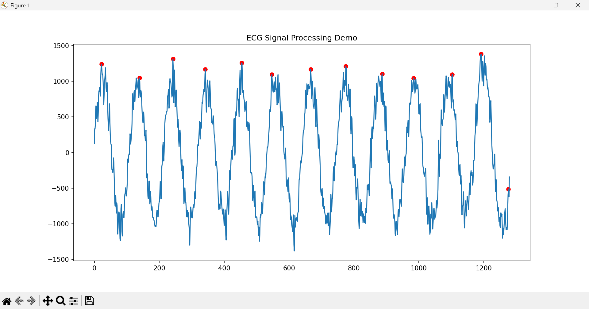

# ecg-signal-processing-system
Real-time ECG signal acquisition, filtering, and analysis using Python and embedded systems concepts
## Features
- ECG signal simulation
- Bandpass and notch filtering
- Peak detection
- Visualization
  
### ▶️ How to Run

pip install -r requirements.txt  
python src/main.py

### 📊 Output

- Filtered ECG-like signal  
- Detected peaks highlighted

### 📸 Sample Output

### ⚠️ Note on Data

The signal used in this project is a **synthetic ECG-like waveform** generated using a sinusoidal signal with added noise.

This approach is used to demonstrate the signal processing pipeline (filtering, noise removal, and peak detection) without relying on proprietary or clinical datasets.

In my internship experience, I have worked with real ECG signals and validation against reference medical devices.

This project is independently developed for learning purposes and does not include any proprietary or confidential code from my internship.
